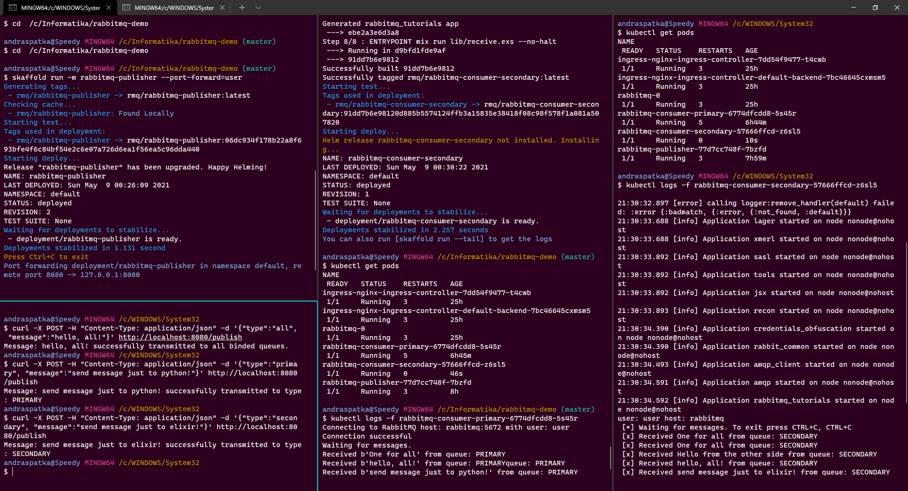

# rabbitmq-demo

Demo project using 3 microservices which are connected with rabbitmq. All services are dockerized and can be deployed to K8s using skaffold/helm.

Assignment:
1. Develop 3 web services A, B, C, each in a different technology (python, php, .net core or java).
2. Service A pushes data into RabbitMQ whenever it receives a request, which broadcasts data to B and C in parallel. B and C only display a log when data was fetched from the queue
3. Run 3 instances of Service A
4. Add a loadbalancer based on nginx in front of the 3 instances
5. All services should be containerized via Docker

# Solution

All of the services were dockerized and for all of them skaffold was configured, in order to make deployments to Kubernetes easier. Helm charts were also used. They might seem like a bit of an overkill for such small project, but still, they bring some advantages:
- Structuring of deployment configurations into different files
- Values.yaml - single source of truth for deployment relevant values
- Easy interface for deployments: helm install, helm uninstall
- Skaffold support

The services were not deployed directly with helm, skaffold was used for the deployments, for which "helm" was configured as the deploy type.

Service overview:
- rabbitmq-publisher: 
    - Quarkus (Java) service
    - Defines three message types: 'primary', 'secondary', 'all'. The choice of these names was arbitrary. 
    - 'primary' message type publishes messages to the 'PRIMARY' queue
    - 'secondary' message type publishes messages to the 'SECONDARY' queue
    - 'all' message type publishes messages to both queues
    - 'direct' exchange type was used for the 'primary' and 'secondary' message types
    - 'fanout exchange was used for the 'all' message type.
    - dockerization was done with the help of 'jib'
    - runs with 3 replicas
    - Load balancer was not additionally configured as Kubernetes already provides a sort of load balancing built-in.
- rabbitmq-consumer-primary:
    - Python service
    - Consumes messages from the 'primary' queue
    - dockerization done with plain old Dockerfiles
    - Runs with 1 replica
- rabbitmq-consumer-secondary:
    - Elixir service
    - Consumes messages from the 'secondary' queue
    - dockerization done with plain old Dockerfiles
    - Runs with 1 replica

Folder structure:
- dashboard
    - kubernetes config files for configuring RBAC for the kubernetes dashboard
- docs
    - documentation
- elixir
    - elixir 'rabbitmq-consumer-secondary' service
- infra
    - contains configuration for 'RabbitMQ' and 'Nginx Ingress Controller' deployment using bitnami helm charts and skaffold. 'Nginx Ingress Controller' is currently unused.
- java
    - quarkus 'rabbitmq-publisher' service
- python
    - python 'rabbitmq-consumer-primary' service

Demonstration:



On this screenshot it can be seen, that all services were deployed ('rabbitmq-publisher' in upper left side, 'rabbitmq-consumer-primary' in the middle and 'rabbitmq-consumer-secondary' on the right side, curl calls to the publisher service in the lower left side).

Three calls are made to the publisher service, the first one goes out to both services. The consumer services display the message accordingly. 

The second call goes out only to the primary consumer service, which then displays the message. 

The third call goes out to the secondary consumer service, which also displays the message accordingly. 

Note that, when the 'primary' or 'secondary' message types are used, only one service consumes them.

The following headings 'Technical details' and 'Deployments' contain further details about the configurations.

# Technical details

## Requirements

- Skaffold: https://skaffold.dev/docs/install/
- Helm: https://helm.sh/docs/intro/install/
- Kubernetes cluster (minikube, k3s, Docker-desktop, kind, etc.)
- Docker
- kubectl (comes with Docker-desktop, can also be installed separately)

## Kubeapps

Kubeapps is recommended as it provides a dashboard for K8s. It is not required, everything that can be done with Kubeapps can be done with kubectl. Kubernetes Dashboard is favored to Kubeapps for the use of a dashboard. Nevertheless, the steps to setting up Kubeapps are the following:

```bash
# Installing kubeapps in namespace "kubeapps" (recommended to install it in a different namespace, as it starts a lot of pods)
helm repo add bitnami https://charts.bitnami.com/bitnami
kubectl create namespace kubeapps 
helm install kubeapps --namespace kubeapps bitnami/kubeapps

# Wait for all pods to be running, check the status with:
kubectl get pods --namespace kubeapps

# Once everything is running, run a port forward command in order to be able to access kubeapps:
kubectl port-forward --namespace kubeapps service/kubeapps 8080:80

# For the login, do the following steps (this is only recommended for local development, for production, setup an oidc mechanism, see: https://github.com/kubeapps/kubeapps/)
kubectl create serviceaccount kubeapps-operator
# giving a service-account a cluster-admin role effectively disables RBAC, as cluster-admin has all permissions.
kubectl create clusterrolebinding kubeapps-operator --clusterrole=cluster-admin --serviceaccount=default:kubeapps-operator

# Get the token for the service account
kubectl get -n default secret $(kubectl get -n default serviceaccount kubeapps-operator -o jsonpath='{.secrets[].name}') -o go-template='{{.data.token | base64decode}}' && echo

# Uninstalling:
helm uninstall kubeapps --namespace kubeapps
# Deleting the service account
kubectl delete serviceaccount kubeapps-operator
# Deleting the namespace
kubectl delete namespace kubeapps
```

## Kubernetes Web Ui (Dashboard)

Kubeapps as a dashboard is somewhat limited, e.g. you can't view the logs of a pod. An alternative to it is the official Kubernetes Web Ui Dashboard: https://kubernetes.io/docs/tasks/access-application-cluster/web-ui-dashboard/

```bash
# Deploying the dashboard
kubectl apply -f https://raw.githubusercontent.com/kubernetes/dashboard/v2.0.0/aio/deploy/recommended.yaml

# create service account
kubectl apply -f dashboard/dashboard-adminuser.yaml

# create role bindings for the service account
kubectl apply -f dashboard/adminuser-clusterrolebinding.yaml

# get the jwt required for logging in
kubectl -n kubernetes-dashboard get secret $(kubectl -n kubernetes-dashboard get sa/admin-user -o jsonpath="{.secrets[0].name}") -o go-template="{{.data.token | base64decode}}"

# make the dashboard accessible
kubectl proxy
```

The dashboard will be accessible at the following url: http://localhost:8001/api/v1/namespaces/kubernetes-dashboard/services/https:kubernetes-dashboard:/proxy/

## Ingress controller (Nginx)

```bash
helm repo add ingress-nginx https://kubernetes.github.io/ingress-nginx
helm repo update

helm install ingress-nginx ingress-nginx/ingress-nginx

# or with skaffold (in root path)
skaffold run -m infra
```


# Deployments

All deployments are managed with skaffold. Skaffold is an open source project from Google which handles deployments to a K8s cluster. The usage of it in this project is a sort of wrapper around helm.

## Infra - infrastructure needed for all services: Rabbitmq, Ingress controller

Deploying rabbitmq and nginx ingress controller is done with the help of the bitnami charts: 
- https://github.com/bitnami/charts/tree/master/bitnami/rabbitmq
- https://github.com/bitnami/charts/tree/master/bitnami/nginx-ingress-controller/#installing-the-chart

```bash
# Add the bitnami charts helm repository to your local helm repositories
helm repo add bitnami https://charts.bitnami.com/bitnami

# Deploy with the help of Skaffold (in root)
skaffold run -m infra
# or if you're in the infra folder, simply:
skaffold run

# port forward in order to access rabbitmq from outside the cluster:
kubectl port-forward --namespace default svc/rabbitmq 5672:5672

# port forward for the rabbitmq management interface:
kubectl port-forward --namespace default svc/rabbitmq 15672:15672

# get password for rabbitmq
echo "Password      : $(kubectl get secret --namespace default rabbitmq -o jsonpath="{.data.rabbitmq-password}" | base64 --decode)"
```

## Deploying the Rabbitmq Publisher service (Quarkus, java)

```bash
# Without port forwarding
skaffold run -m rabbitmq-publisher

# With port forwarding
skaffold run -m rabbitmq-publisher --port-forward=user
```

If skaffold was ran with the "--port-forwarding" option, then it automatically forwards the containers 8080 port to the host machine's 8080 port. i.e. the service will be available at localhost:8080.

If skaffold was ran without the "--port-forwarding" option, then the port forwarding should be done manually:

```bash
# list all pods
kubectl get pods

# look for the pod name, copy it, then:
# NOTE: pod name will probably be something else on your machine (instead of: "rabbitmq-publisher-77d7cc748f-9m65s")
kubectl port-forward rabbitmq-publisher-77d7cc748f-9m65s 8080:8080
```

Calling the publisher service:

```bash
# Send message to both queues
curl -X POST -H "Content-Type: application/json" -d '{"type":"all", "message":"hello, all!"}' http://localhost:8080/publish

# Send message only to the primary queue
curl -X POST -H "Content-Type: application/json" -d '{"type":"primary", "message":"send message just to python!"}' http://localhost:8080/publish

# Send message only to the secondary queue
curl -X POST -H "Content-Type: application/json" -d '{"type":"secondary", "message":"send message just to elixir!"}' http://localhost:8080/publish
```

## Deploying the Rabbitmq Consumer service (Python, consumes the "primary" queue)

```bash
# Without port forwarding
skaffold run -m rabbitmq-consumer-primary

# Getting the logs
kubectl logs <pod_name>

# Get the pod name with
kubectl get pods
```

## Deploying the Rabbitmq Consumer service (Elixir, consumes the "secondary" queue)

```bash
# Without port forwarding
skaffold run -m rabbitmq-consumer-secondary

# Getting the logs
kubectl logs <pod_name>

# Get the pod name with
kubectl get pods
```

## Deploying everything at once

The beauty of Skaffold is that all configurations can be deployed at once with a simple command:

```bash
# Run it in the root folder
skaffold run
```